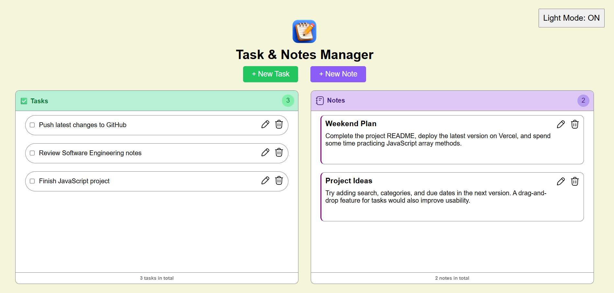
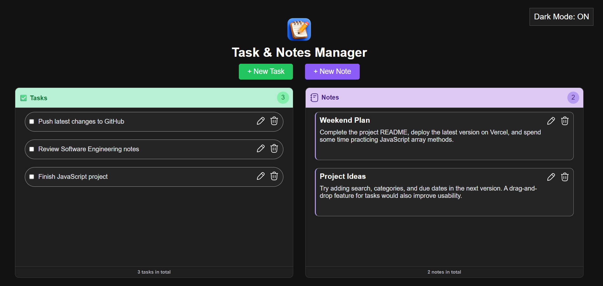
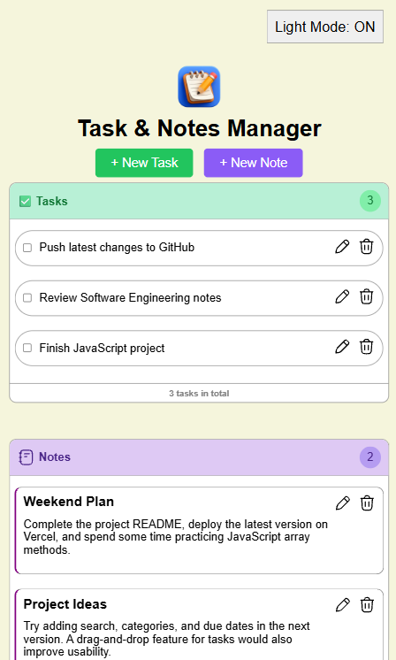
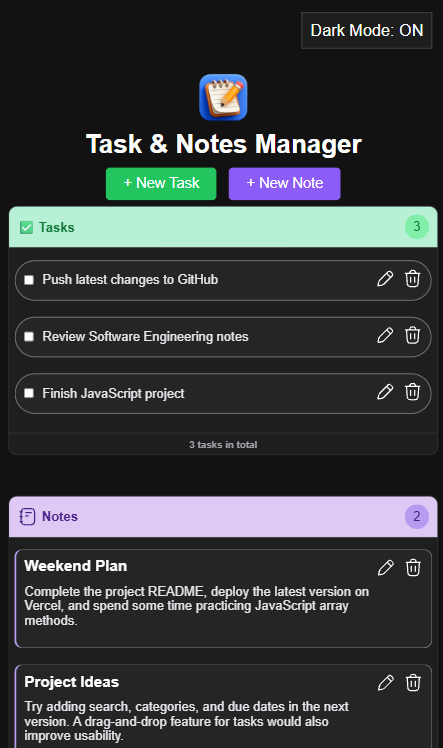

# 📝 Task & Notes Manager

A responsive Task & Notes Manager built using **HTML, CSS, and Vanilla JavaScript**. The application lets users manage everyday tasks and personal notes in a simple interface while storing all data in the browser using **Local Storage**, so nothing is lost after refreshing or reopening the page.

This project was built to strengthen my understanding of JavaScript, DOM manipulation, event handling, responsive web design, and browser storage by creating a practical application without using any external libraries or frameworks.

---

## 🚀 Features

### ✅ Task Management
- Add new tasks
- Edit existing tasks
- Delete tasks
- Mark tasks as completed
- Live task counter
- Prevents multiple unfinished task inputs

### 📝 Notes Management
- Create notes with a title and description
- Edit existing notes
- Delete notes
- Separate notes counter
- Prevents multiple unfinished note inputs

### 🎨 User Interface
- Responsive layout for desktop, tablet, and mobile devices
- Light/Dark mode toggle
- Separate sections for tasks and notes
- Scrollable task and notes panels
- Clean and minimal interface

### 💾 Data Persistence
- Uses **Local Storage** to save tasks, notes, completion status, and theme preference.
- Data remains available even after refreshing or reopening the browser.

---

## 🛠️ Built With

- HTML5
- CSS3
- Vanilla JavaScript (ES6)
- Local Storage API

---

## 📂 Project Structure

```
Task-Notes-Manager/
│
├── index.html
├── style.css
├── script.js
├── images/
│   └── ...
└── README.md
```

---

## 📸 Screenshots

### Desktop

<p align="center">
  
  
</p>

### Mobile

<p align="center">
  
  
</p>

---

## 🎯 What I Practiced

This project helped me practice:

- DOM manipulation
- Event handling
- Dynamic element creation
- Form validation
- Responsive layouts with CSS
- Flexbox
- Media Queries
- Local Storage
- Working with arrays and objects
- Keeping UI and stored data synchronized

---

## ⚡ Getting Started

Clone the repository:

```bash
git clone https://github.com/your-username/task-notes-manager.git
```

Open the project folder:

```bash
cd task-notes-manager
```

Finally, open `index.html` in your browser.

No installation or dependencies are required.

---

## 🌐 Live Demo

You can view the live project here:

**https://your-vercel-link.vercel.app**

*(Replace this with your deployed link.)*

---

## 📌 Future Improvements

Some ideas I'd like to add in future versions:

- Search tasks and notes
- Categories or tags
- Due dates and reminders
- Drag-and-drop task sorting
- Rich text formatting for notes
- Export and import data
- Filter completed and pending tasks

---

## 👨‍💻 Author

**Abdur Rehman**

Software Engineering Student

GitHub: https://github.com/abdurehmaan366

---

## 📄 License

This project is open source and available under the MIT License.
